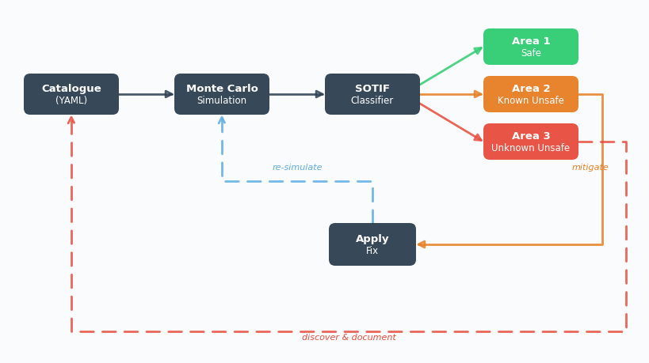
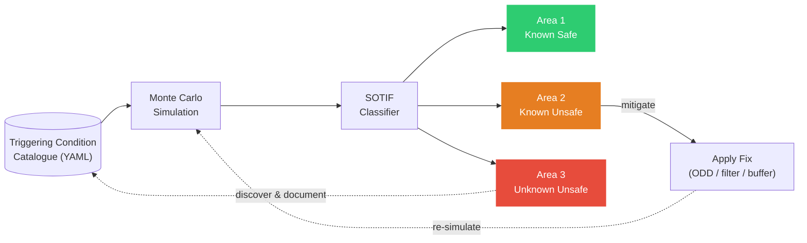
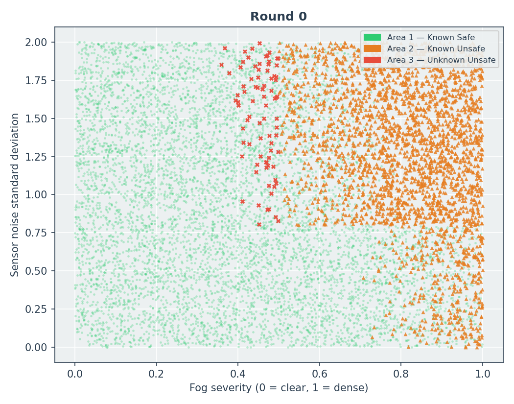
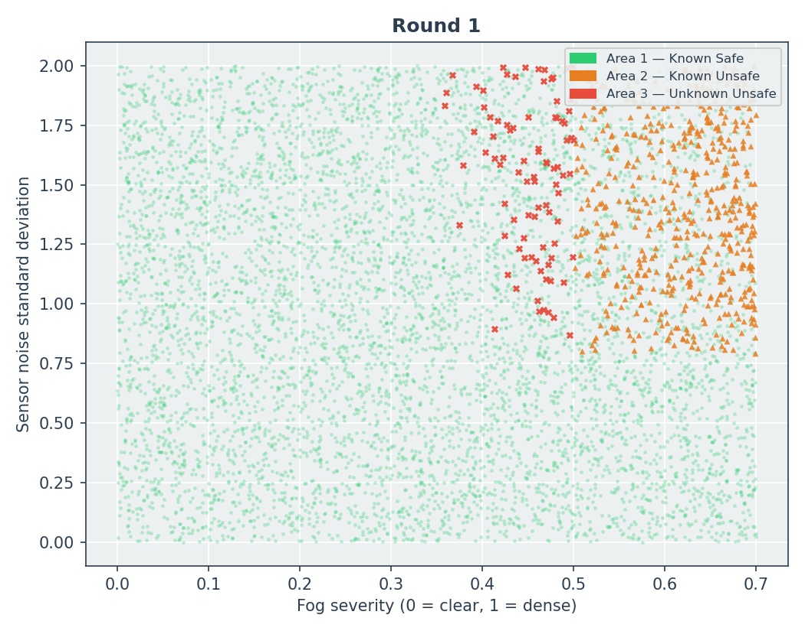
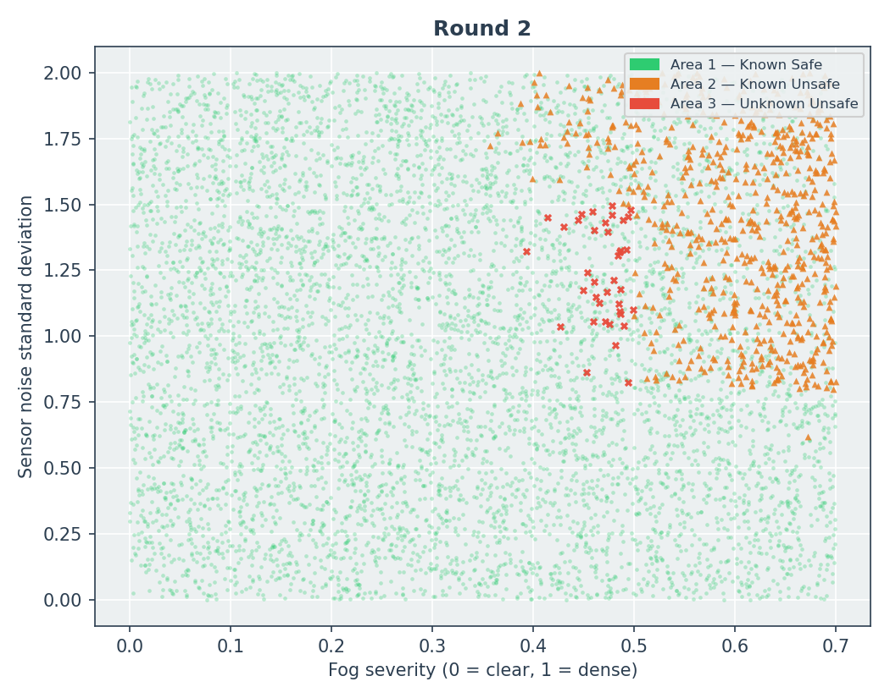
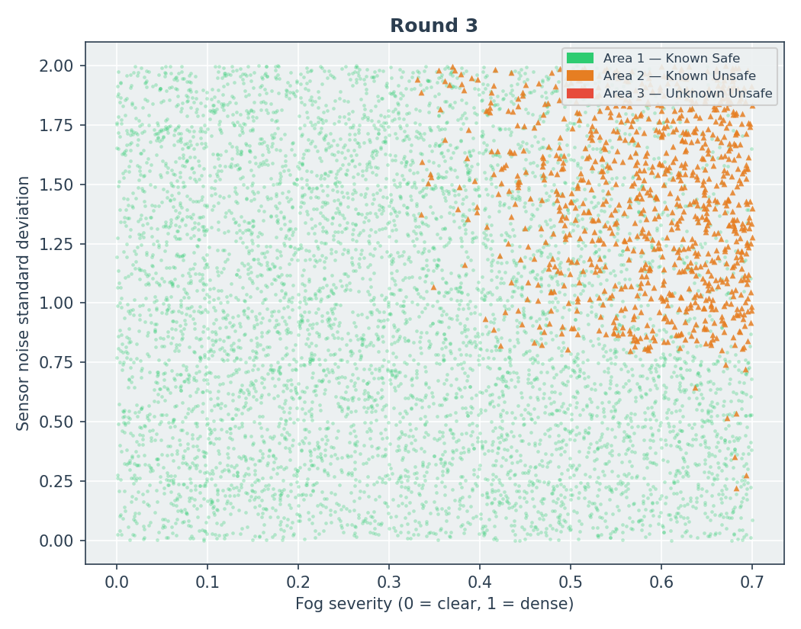
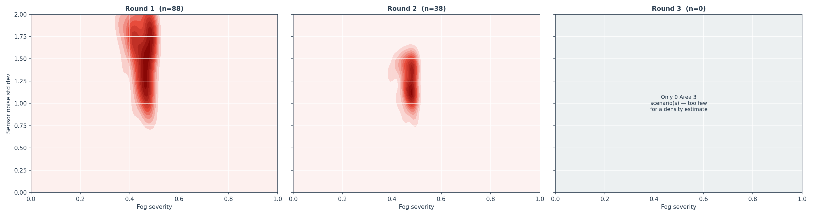
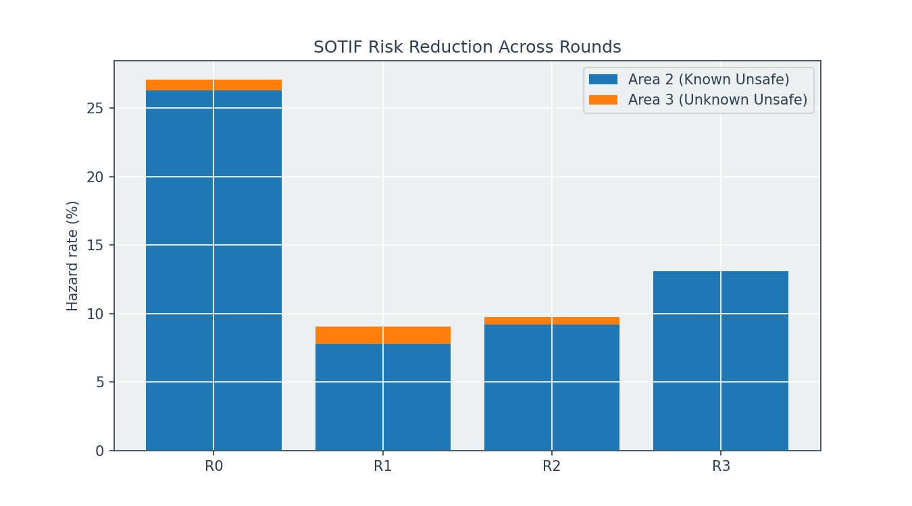

# SOTIF-AEB-Monte-Carlo-Analysis

⭐ **1. Introduction**

ISO 26262 addresses hazards arising from system failures. However,
advanced driver assistance systems (ADAS) and automated driving functions
can also become unsafe despite the absence of hardware or software faults.

ISO 21448 (Safety of the Intended Functionality, SOTIF) addresses these
hazards by identifying:

- safe scenarios (Area 1)
- known unsafe scenarios (Area 2)
- unknown unsafe scenarios (Area 3)
- and applying iterative validation and mitigation.

This project implements a simplified SOTIF workflow for an
Automatic Emergency Braking (AEB) function to demonstrate how triggering
conditions can be discovered, documented, classified, and mitigated.

<table>
  <tr>
    <td align="center">
      <b></b> 
      
    </td>
  </tr>
</table>

---

🧩 **2. Challenge**

Automatic Emergency Braking (AEB) operates in complex, dynamic environments where safety depends not only on component reliability but also on environmental conditions (e.g. fog/ glare/ low illumination) and system performance limits (sensor noise/ latency).

Traditional validation approaches are insufficient because many unsafe behaviors arise without any hardware or software failure — instead emerging from **functional limitations under specific operational conditions**, which is the core focus of SOTIF (ISO 21448).

Key challenges include:
- Validating AEB safety across a wide and continuously varying Operational Design Domain (ODD)
- Capturing non-fault-related hazards where correct system behavior still leads to unsafe outcomes
- Identifying non-linear interactions between conditions such as fog, sensor noise, and latency
- Separating known unsafe conditions from previously unknown hazardous scenarios discovered through large-scale simulation
 
---

🎯 **3. Objectives**

Key objectives include:
- Simulate AEB performance across diverse environmental and operational conditions using Monte Carlo scenarios.
- Identify and classify hazardous scenarios using a SOTIF (ISO 21448) area-based framework.
- Distinguish between known unsafe conditions (catalogued triggers) and unknown unsafe scenarios (emergent risks).
- Track how system safety improves across successive design changes such as ODD restrictions, filtering and added safety margins.
---

🛠 **4. Tech Stack**

This project is implemented as a simulation-based safety analysis pipeline combining physics-based modeling, Monte Carlo scenario generation, and SOTIF-driven classification logic.

Key technologies include:
- Python – core orchestration of the AEB safety simulation pipeline
- NumPy – random scenario generation and numerical computation of physical relationships
- Pandas – structured representation of simulated driving scenarios and hazard classification results
- PyYAML – loading and versioning of the triggering-condition catalogue
- SciPy – density estimation for identifying clusters of unsafe scenarios (KDE analysis)
- Matplotlib – visualization of SOTIF area distribution, risk evolution, and scenario space exploration

---
🧠 **5. Key Concepts**

*A. Triggering Condition Catalogue (.yaml)*

The project uses a dedicated triggering-condition catalogue to capture everything the engineering team has learned about unsafe AEB operating conditions. Refer to the `.yaml` file in the repository.

Each catalogue entry records:
- the triggering condition identified (e.g., heavy fog, high sensor noise)
- the operating conditions under which it becomes unsafe
- the mitigation introduced to address it
- the catalogue version in which it was added

This approach is intended to mimic how a safety engineering team would iteratively develop, validate, and refine an ADAS function during a SOTIF (ISO 21448) program. As new hazards are discovered through testing and simulation, they are incorporated into the catalogue, allowing the system to be continuously improved and re-evaluated.

This reflects a key principle of SOTIF: safety knowledge evolves over time!

---

*B. Simulation Methodology (Monte Carlo)*

A Monte Carlo simulation is used to generate a large number of randomized driving scenarios (10,000), allowing the AEB system to be evaluated across a wide range of environmental and operational conditions that would be impractical to test exhaustively in the real world.

Each scenario randomly samples:

| Parameter | Range |
|-----------|-------|
| Ego speed | 30–80 km/h |
| Fog severity | 0.0–1.0 |
| Sensor noise | 0.0–2.0 m |
| Processing latency | 0.0–0.3 s |

For each scenario, the AEB model calculates:
- the distance required for the vehicle to safely stop,
- the effective obstacle detection range of the perception system,
- whether a hazardous situation occurs.

A scenario is classified as hazardous whenever:

> **Detection Range < Required Stopping Distance**

<table>
  <tr>
    <td align="center">
      <b></b> 
      
    </td>
  </tr>
</table>

In the animation above, the blue cone is the sensor's detection range and the dashed orange line marks the distance actually needed to stop — when the orange line falls outside the blue cone, the car can't stop in time.

Watch how fog shortens the blue cone in the second pass, turning a comfortable margin (safe stop) into a shortfall (hazard).

---

*C. SOTIF Classification*

Hazardous scenarios are classified according to the SOTIF (ISO 21448) framework:

| Area | Meaning |
|---|---|
| **Area 1** | Known safe — no hazard |
| **Area 2** | Known unsafe — hazard occurs, and the team has already documented this trigger |
| **Area 3** | Unknown unsafe — hazard occurs, and **no one has documented it yet** |

Unlike conventional threshold-based approaches, Area 2 and Area 3 classifications are determined dynamically using the triggering-condition catalogue (`.yaml`):

- **Match found in the catalogue** → **Area 2 (known unsafe)**
- **No match found in the catalogue** → **Area 3 (unknown unsafe)**

This enables the project to mimic the SOTIF validation process, where previously unknown hazardous scenarios are gradually discovered, documented, and mitigated over successive validation rounds.

---

*D. Iterative Mitigation Process* 

Four validation rounds are performed:

| Round | Mitigation | Purpose |
|-------|------------|---------|
| **0** | Baseline | Establish the initial hazard landscape using the original system configuration and available catalogue knowledge. |
| **1** | Fog ODD restriction | Reduce known hazards by restricting the **Operational Design Domain (ODD)** under severe fog conditions. |
| **2** | Noise filtering | Reduce the impact of sensor noise on perception performance and mitigate the resulting hazardous scenarios. |
| **3** | Additional stopping-distance buffer | Introduce a conservative safety margin to account for residual uncertainty and interaction effects. |

The triggering-condition catalogue evolves throughout the validation process:

- **v1.0 – Fog:** Heavy fog is identified as the first documented unsafe triggering condition through closed-track fog testing.
- **v1.1 – Sensor noise:** High sensor noise is documented following sensor characterization studies, enabling the introduction of a noise-filtering mitigation strategy.
- **v1.2 – Fog–noise interaction:** A previously unknown interaction between fog and sensor noise is discovered through Monte Carlo analysis and incorporated into the catalogue.

This progression demonstrates the central SOTIF principle that system knowledge evolves through iterative validation, discovery, and mitigation.

---
🧠 **6. Simplified System Architecture**

The goal of a SOTIF in this project isn't to make Area 3 disappear by definition — it's to keep finding what's hiding there, document it (i.e. shrinking Area 3, growing Area 2).

Once a risk is known, we build a mitigation for it (e.g. Limiting the ODD/ Building more robust sensor filters). It moves from Area 2 → Area 1 — now it's *actually* safe.

---

📈 **7. Results and Observations**

- **Summary**

The simulation was executed over four successive validation rounds. As additional knowledge was gained and mitigations were introduced, the distribution of scenarios across the SOTIF areas evolved accordingly.

| Validation Round | Area 1 (Known Safe) | Area 2 (Known Unsafe) | Area 3 (Unknown Unsafe) | Total Hazard Rate |
|:----------------:|:----------------------:|:------------------------:|:--------------------------:|:-----------------:|
| Round 0 — Baseline | 72.9% | 26.3% | 0.8% | 27.1% |
| Round 1 — ODD Restriction | 91.0% | 7.8% | 1.3% | 9.0% |
| Round 2 — Noise Filtering | 90.3% | 9.2% | 0.5% | 9.7% |
| Round 3 — Safety Buffer | 86.9% | 13.1% | 0.0% | 13.1% |

---

- **Round 0 — Baseline**

  - The baseline configuration resulted in a **27.1% hazardous scenario rate**, consisting primarily of **known hazards (Area 2: 26.3%)** and a small fraction of **unknown hazards (Area 3: 0.8%)**.

  - In this illustrative SOTIF case study, the engineering team is assumed to have previously identified that **fog severity > 0.50** can significantly degrade the perception system and has therefore documented this as **TC-001** in the triggering-condition catalogue. Hence all runs with fog severity > 0.5 and hazard flag active are known unsafe hazards. However, we also see 0.8& of the test runs have a fog severity < 0.5 but still have a active hazard flag. These are yet to be understood or docuemnted. Hence they are unknown unsafe hazards.
  - NOTE: It is not necessary that all simulations with fog severity > 0.5 result in a hazard. As can be seen there can be several scenarios in which despite of the heavy fog the AEB operates fine (for example if the speed of the EGO is low or if the sensor latency is low).
  - Now, before the next round of testing - say the fictional test team decalres a restriction in the usage of the AEB (i.e. redefines the ODD of the AEB function). They say beyond a fog severity of 0.7, the AEB will no longer function and hand over the control of the brakes to the driver with a message on the HMI. The ODD cap is set at 0.70, not 0.50, because test team has already validated standard AEB performance up to that point — the 0.50–0.70 band is a known gap covered by an enhanced AEB still in R&D.
  - **In simpler words - a hazard between fog severeity of 0.5 and 0.7 is a known hazard which will be mitigated by ongoign R&D. However, fog severity above 0.7 is no longer part of the ODD and should not be tested in Round 1.**
  
<table>
  <tr>
    <td align="center">
      
      
<b>Monte Carlo Results - Post Round 0</b>

    </td>
  </tr>
</table>

---

- **Round 1 — Operational Design Domain (ODD) restriction**

  - By restricting the **Operational Design Domain (ODD)** to reduce exposure to severe fog conditions, the total hazardous scenario rate decreased from **27.1% to 9.0%**.

  - Nevertheless, the rate of **Area 3 scenarios increased slightly from 0.8% to 1.3%**. This occurs because the dominant known hazard (heavy fog) has been reduced, making the previously undiscovered fog–sensor interaction more visible within the remaining scenario population.
 
  - From this round of SOTIF analysis, it is clear that there exists a region of unknown hazards i.e. although the fog severity < 0.5, the runs end up as being hazards. The common pattern among all area 3 runs is clearly that they occur from moderate to high sensor noise standard deviation. Hence the fictional test team must now validate this finding and bring out scientiic evidence to support the claim that moderate to high sensor noise causes drop in performance of AEB and put an accurate number to this.
 
  - The team carries out tests and comes back with scientififc evidence that whenever the sensor noise is above 1.50, the AEB perfromance drops and docuemnts this as **TC-002** in the live catalog. Hence the catalog now has 2 known trggers (fog > 0.5 and Sensor Noise > 1.5) and 1 ODD restrcition (fog > 0.7) as fixed by the test team.
 
  - We run the next set of Monte Carlo simulations with these rules. 

<table>
  <tr>
    <td align="center">
      
      
<b>Monte Carlo Results - Post Round 1</b>

    </td>
  </tr>
</table>

---

- **Round 2 — Sensor perfromance trigger - included**

  - In this illustrative workflow, the engineering team is assumed to have identified **sensor noise > 1.50 m** as another hazardous operating condition and documented it as **TC-002**.

  - With the updated catalogue, the known unsafe scenarios increae (7.8% in Round 1 to 9.2 percentage in Round 2) while the unknon unsafe scenarios decresae (1.3% in Round 1 to 0.5 % in round 2) as expected.
 
  -   However, a small cluster of scenarios with:

      - **fog severity > 0.25**, and
      - **sensor noise between approximately 0.8 m and 1.5 m**

  continued to produce hazardous behavior and hence these scenarios remained classified as **Area 3**. If one were to guess these scenarios might probably arise due to the interaction effects of the fog and the sensor noise. Although niether of them ny themselves is severe enough to degrade the perfoance of the AEB, when both values are moderate enough maybe the AEB's perfromance drops.
  
  -   Hence this will now be the next target of the testing team - i.e. to prove/ disprve scientifically that intercation effects exist and once again put solid numbers to it.
 
  -   Analysis of the residual hazardous scenarios revealed that the combination:

      - **fog severity > 0.25**, and
      - **sensor noise > 0.80 m**

  represented a previously undocumented interaction effect. In this illustrative SOTIF workflow, this interaction was added to the triggering-condition catalogue as **TC-003**.
  
<table>
  <tr>
    <td align="center">
      
      
<b>Monte Carlo Results - Post Round 2</b>

    </td>
  </tr>
</table>

---

- **Round 3 — Discovery of interaction effects**

  - The team introduces an additional safety margin of 5 m to make the AEB SOTIF workflow more conservative and includes the interaction effects mentioned in Round 2 to the trigger catalogue. 

  - This finally results in an **unknown hazard percenatge of 0.00%**. 

  - Although the final hazardous scenario rate increased slightly to **13.1%**, this reflects a key principle of SOTIF: the objective is not necessarily to eliminate all hazards, but to ensure that hazardous scenarios are identified, understood, documented, and mitigated. These 13.1% of hazards are identified, understood and docuemnted. Mitigation of these hazards in not within the scope of this repo.

<table>
  <tr>
    <td align="center">
      
      
<b>Monte Carlo Results - Post Round 3</b>

    </td>
  </tr>
</table>

---

- **Evolution of Test Space for Unknown Hazards**

The figure below shows how the test space for the test team evolved after every round of monte carlo simulation using the updated trigger catalogue. In simpler words, the highlighted region in the density maps represents the region where the testing team should ideally focus to discover scientifi creasoning behind unknown - unsafe hazards. 

<table>
  <tr>
    <td align="center">
      
      
<b>Density Maps - Unkown Unsafe Hazards</b>

    </td>
  </tr>
</table>

The figure below represents how the proportion of known and unknown hazards change with each passing validation round. 

<table>
  <tr>
    <td align="center">
      
      
<b>Iterative Unknown Risk Reduction - SOTIF</b>

    </td>
  </tr>
</table>

---

📊 **8. Key Outcomes**

- This project sucessfully demonstrates a SOTIF-inspired validation workflow for an Automatic Emergency Braking (AEB) system using Monte Carlo scenario exploration and hazard classification.
- It shows how previously unknown hazardous scenarios (Area 3) can be systematically discovered, documented as triggering conditions, and incorporated into the safety docuemnt. 
- It illustrates the iterative reduction of residual risk through successive mitigations, including ODD restrictions, perception improvements, and safety margins.
---

⚠️ **9. Limitations & What this project is not?**

- **Simplified AEB physics model:** The Automatic Emergency Braking function is represented using a basic kinematic stopping-distance formulation (reaction time + braking distance + safety buffer), without modeling full vehicle dynamics, tire-road interaction, or control system complexity.
- **Simplified sensor and environment models:** Perception is abstracted using parameterized fog severity, sensor noise standard deviation, and latency effects to approximate detection degradation, rather than detailed sensor fusion or signal-level simulation.
- **Deterministic interpretation of unknown hazards:** The model assumes that once an unknown hazardous region (Area 3) is identified, it can be fully characterized and converted into a known triggering condition (Area 2) through catalogue updated by a fictional testing team.

These simplifications are intentional, as the primary objective of this project is to demonstrate the iterative SOTIF workflow for hazard discovery, classification, and mitigation in an ADAS context rather than to build a production-grade vehicle simulation.

For more detailed ADAS and perception-heavy projects, please refer to the following repositories:
- 🔗  <a href="https://github.com/pradeepmadanagopalan-hash/Multi-Sensor-EKF-Localization"> Multi-Sensor-EK-Localization</a>
- 🔗  <a href="https://github.com/pradeepmadanagopalan-hash/Autonomous-Driving-Perception-Pipeline"> Autonomous-Driving-Perception-Pipeline</a>
- 🔗  <a href="https://github.com/pradeepmadanagopalan-hash/Stereo-Vision-Depth-Map"> Stereo-Vision-Depth-Map</a>

---

⚠️ **10. Data Note**

This project was developed voluntarily for demonstration purposes and does not contain or use any proprietary or confidential data.

The validation workflow, triggering-condition catalogue, and iterative mitigation process are illustrative and were designed to represent a possible SOTIF-oriented ADAS development and validation process.

---

👨‍💻 **11. Skills Demonstrated**

Through this project, I demonstrate my ability to:

- Design and implement a simulation-based SOTIF validation workflow for ADAS functions using Monte Carlo scenario exploration.
- Develop simplified physics-based hazard evaluation models and classify scenarios according to SOTIF area concepts.
- Design and maintain triggering-condition catalogues to support iterative hazard discovery, documentation, and mitigation activities.
- Analyze and visualize residual risk evolution across successive validation and mitigation rounds.

---

